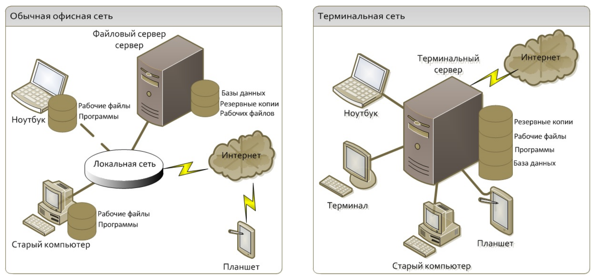
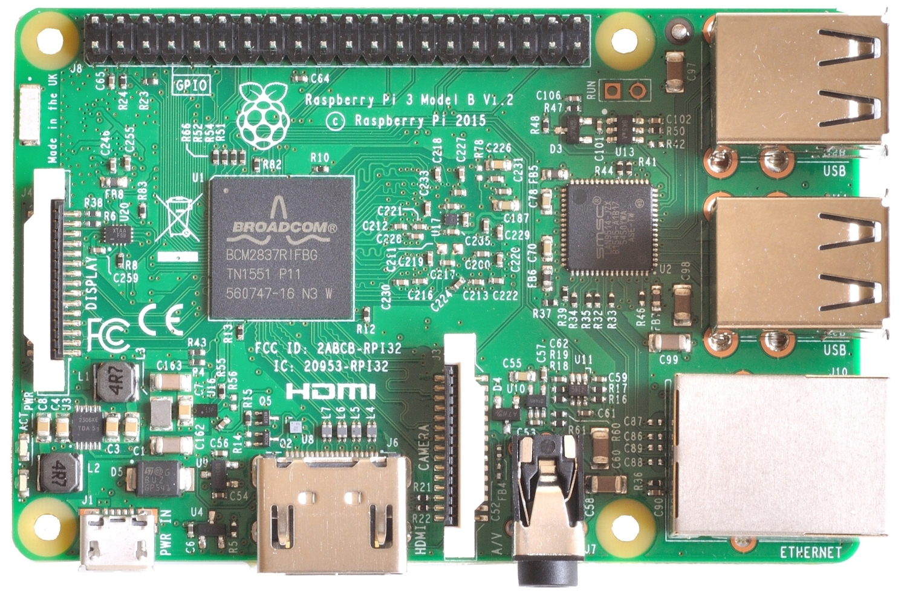
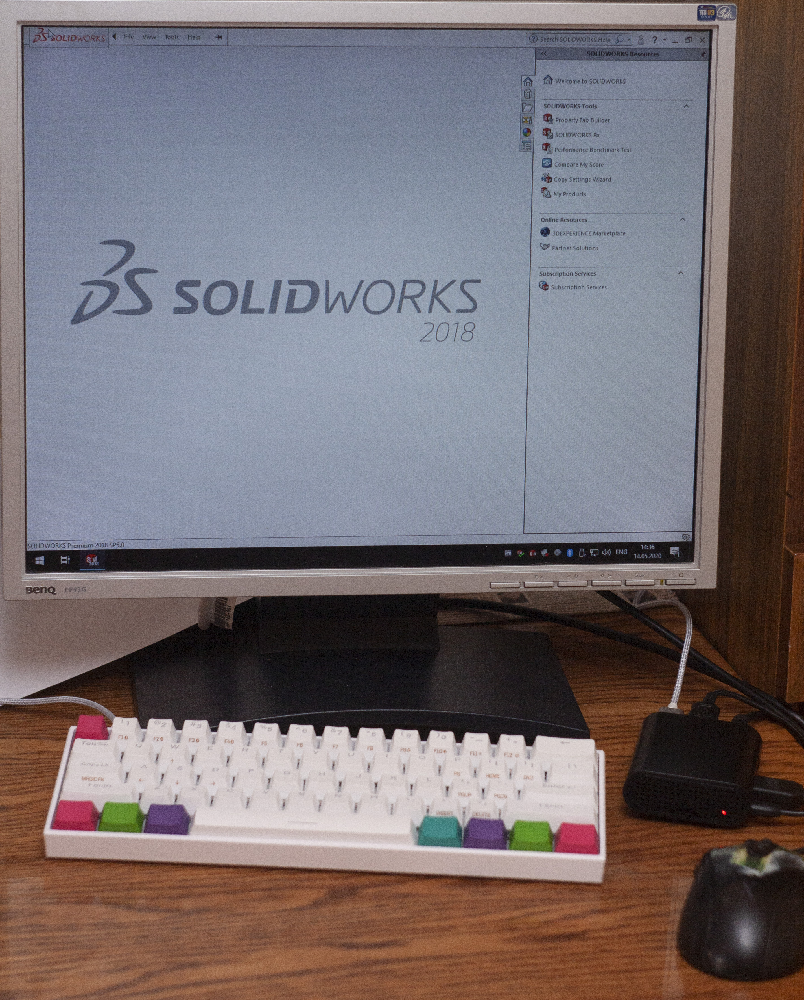
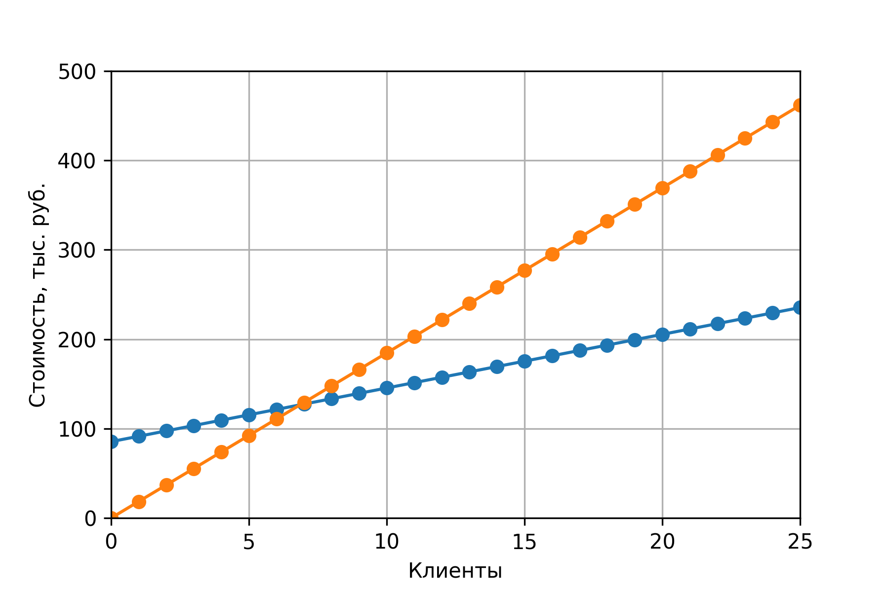

% Разработка сети кафедры на базе тонких клиентов / терминальных станций
% Майларов Дмитрий Александрович, студент группы РК-62
% Санкт-Петербург, 19 июня 2020 года

## Содержание доклада по ВКР

1. Актуальность
2. Цели и задачи
3. Выбор программного и аппаратного обеспечения
4. Установка и настройка комплекса
5. Анализ результатов
6. Заключение

## Актуальность

Актуальность работы состоит в том, что вычислительные ресурсы на кафедре КПРС 
недостаточны для комфортной работы студентов в программных продуктах.
При модернизации компьютерных классов есть возможность \alert{значительно снизить
затраты}, используя архитектуру тонких клиентов.

## Цели и задачи

**Цель ВКР** - разработать общевычислительный многопользовательский
программно-аппаратный комплекс.

Для достижения цели были поставлены **задачи на ВКР**:

- Рассмотреть технологии организации вычислительных сетей
- Разработать проект программно-аппаратного комплекса
- Установить и настроить комплекс
- Проанализировать результаты работы

---

## Преимущества системы тонких клиентов

- Экономия средств
- Надежность
- Безопасность
- Централизация
- Эффективность
- и другие

## Программно-аппаратный комплекс (ПАК)

- Сервер приложений
- Тонкие клиенты
- Сеть, их соединяющая

## Выбор аппаратного обеспечения

Для тестирования серверной части используется следующая конфигурация:

- Процессор: AMD Ryzen 5 2600
- Видеокарта: AMD Radeon RX 570 4GB
- Частота процессора: 3.8 ГГц
- Количество потоков: 12
- Объем RAM: 16 ГБ
- Частота RAM: DDR4, 3200 МГц
- Устройство хранения: 1ТБ SSD

---

## Выбор программного обеспечения

Протокол удаленного доступа - RDP.

Для сервера используется Windows Server 2019 Essentials.

На клиенте используется ОС Raspbian, для удаленного доступа - xfreerdp2,
клиент протокола RDP.

---

## Тестирование производительности

Тестирование производится на следующих конфигурациях:

1. Компьютеры, используемые на кафедре КПРС
2. Тестовый сервер (оценка чистой производительности)
3. Тонкий клиент + сервер (2 пользователя)
4. Тонкий клиент

---

## Результаты тестирования

По результатам теста в Solidworks можно сделать вывод:

при работе одного пользователя разработанный клиент \alert{в 2 раза производительнее}
используемых на кафедре рабочих станций.

Тестирование производительности в синтетическом
тесте PCMark10 подтвердило данный вывод (**5201** у.е. против **2089** у.е.).

## Экономическая эффективность

Для расчета принята стоимость одного толстого клиента 18 467 рублей. 
тонкого клиента - 6 000 рублей, сервера - 85 427 рублей.

Количество клиентов          | 15     | 20     | 25
---                          | :---:  | :---:  | :---:
Толстые клиенты, руб         | 277005 | 369340 | 461675
Cервер и тонкие клиенты, руб | 175427 | 205427 | 235427
Экономия, %                  | 58     | 80     | 96

---

## Заключение

- Поставленные задачи были выполнены в полном объеме.
- В ходе выполнения ВКР была достигнута цель - разработка производительного и
экономически эффективного программно-аппаратного комплекса для кафедры КПРС.
