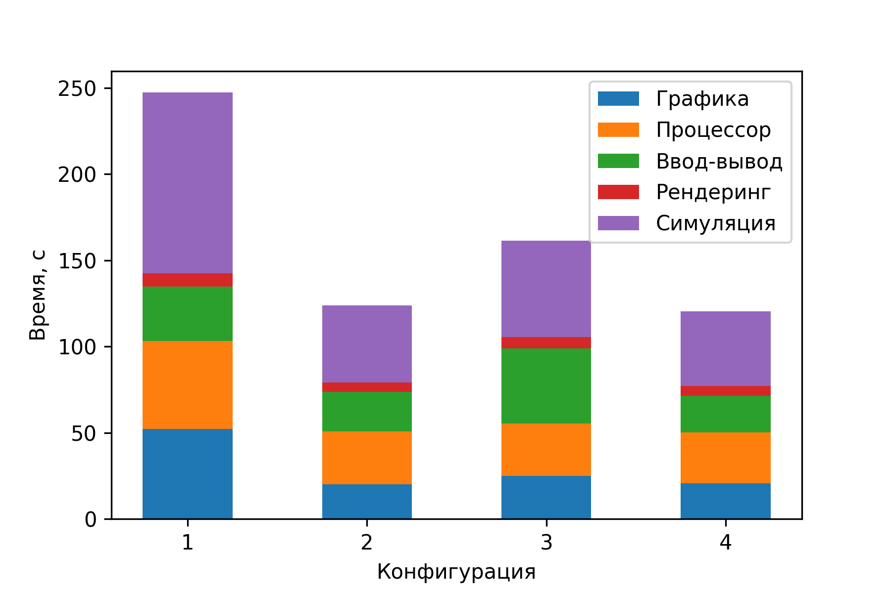

% Разработка сети кафедры на базе тонких клиентов / терминальных станций
% Майларов Дмитрий Александрович, студент группы РК-62
% Санкт-Петербург, 19 июня 2020 года

## Содержание доклада по ВКР

1. Актуальность
2. Цели и задачи
3. Выбор программного и аппаратного обеспечения
4. Установка и настройка комплекса
5. Анализ результатов
6. Заключение

## Getting up

- Turn off alarm
- Get out of bed

## Breakfast

- Eat eggs
- Drink coffee

# In the evening

## Dinner

- Eat spaghetti
- Drink wine

------------------

## Going to sleep

- Get in bed
- Count sheep
